# Pipeline de Acidentes ANTT — Microsoft Fabric

> Pipeline de dados end-to-end no **Microsoft Fabric** para análise de acidentes em rodovias federais concedidas.  
> Arquitetura Medallion (Bronze → Silver → Gold) · Constellation Schema · Direct Lake · Power BI

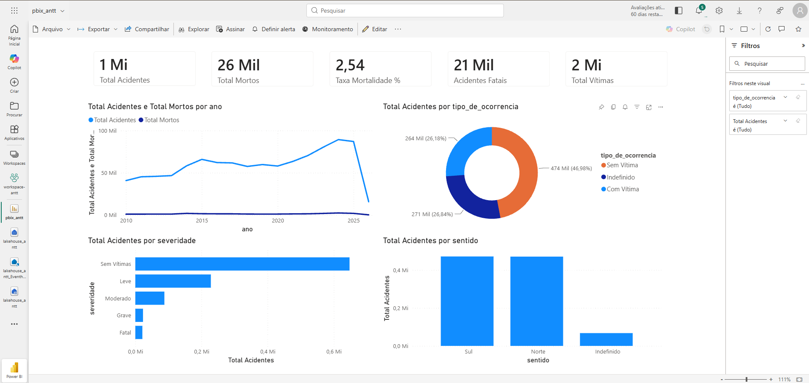

| Métrica | Valor |
|---|---|
| Registros processados | ~1 milhão de acidentes |
| Óbitos no período | ~26 mil |
| Taxa de mortalidade | 2,54% |
| Concessionárias cobertas | 35 |
| Histórico | 2007 – 2025 |
| Tamanho Gold (OneLake) | ~62 MB (Delta Parquet compactado) |

---

## Sumário

1. [Visão Geral da Arquitetura](#1-visão-geral-da-arquitetura)
2. [Stack Tecnológica](#2-stack-tecnológica)
3. [Estrutura do Repositório](#3-estrutura-do-repositório)
4. [Modelo de Dados — MER](#4-modelo-de-dados--mer)
   - [Silver Layer](#silver-layer)
   - [Gold Layer — Constellation Schema](#gold-layer--constellation-schema)
5. [Pré-requisitos](#5-pré-requisitos)
6. [Passo a Passo de Implantação](#6-passo-a-passo-de-implantação)
   - [6.1 Criar o Workspace](#61-criar-o-workspace)
   - [6.2 Organizar o Workspace em Pastas](#62-organizar-o-workspace-em-pastas)
   - [6.3 Criar o Lakehouse](#63-criar-o-lakehouse)
   - [6.4 Upload dos CSVs — Camada Bronze](#64-upload-dos-csvs--camada-bronze)
   - [6.5 Importar os Notebooks](#65-importar-os-notebooks)
   - [6.6 Criar o Data Pipeline](#66-criar-o-data-pipeline)
   - [6.7 Executar o Pipeline](#67-executar-o-pipeline)
   - [6.8 Verificar as Tabelas no Lakehouse](#68-verificar-as-tabelas-no-lakehouse)
   - [6.9 Explorar pelo SQL Endpoint](#69-explorar-pelo-sql-endpoint)
   - [6.10 Criar o Modelo Semântico](#610-criar-o-modelo-semântico)
   - [6.11 Criar o Relatório no Power BI](#611-criar-o-relatório-no-power-bi)
7. [Notebooks — Detalhes Técnicos](#7-notebooks--detalhes-técnicos)
8. [Otimizações Spark](#8-otimizações-spark)
9. [Medidas DAX](#9-medidas-dax)
10. [Sugestão de Dashboard](#10-sugestão-de-dashboard)

---

## 1. Visão Geral da Arquitetura

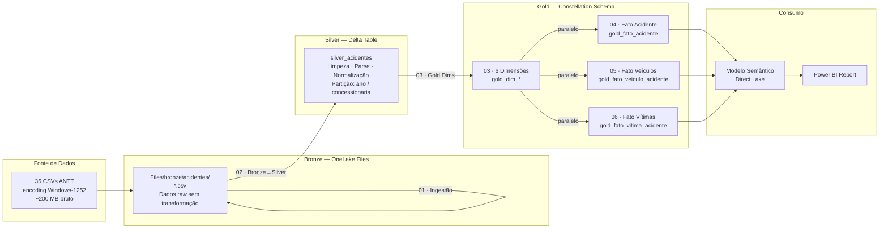

### Pipeline de Orquestração (`pl_acidentes_antt`)

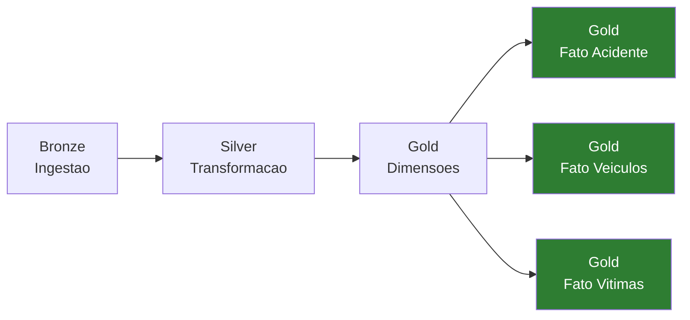

Os 3 notebooks de fato executam em **paralelo** após as dimensões — reduzindo o tempo total de ~10 min para ~7 min.

---

## 2. Stack Tecnológica

| Componente | Tecnologia |
|---|---|
| Plataforma | Microsoft Fabric (Trial 60 dias / capacidade F64+) |
| Armazenamento | OneLake — Delta Lake (Parquet + transaction log) |
| Processamento | Apache Spark 3.3 — Fabric Runtime 1.2 |
| Linguagem | PySpark + Spark SQL |
| Orquestração | Data Pipeline (interface visual, compatível com ADF) |
| Modelagem semântica | Modelo Semântico — modo Direct Lake |
| Visualização | Power BI Desktop / Power BI no Fabric |
| Fonte de dados | ANTT — Demonstrativo de Acidentes por Concessionária |

---

## 3. Estrutura do Repositório

```
09-Projeto-Fabric/
│
├── notebooks/
│   ├── 00_nb_config.ipynb                       ← logging centralizado (%run)
│   ├── 00_nb_helpers.ipynb                      ← imports, constantes e funções (%run)
│   ├── 01_nb_ingestao_bronze_acidentes.ipynb    ← Bronze: validação dos CSVs
│   ├── 02_nb_bronze_to_silver.ipynb             ← Silver: limpeza e transformações
│   ├── 03_nb_gold_dims.ipynb                    ← Gold: 6 dimensões
│   ├── 04_nb_gold_fato_acidente.ipynb           ← Gold: fato principal
│   ├── 05_nb_gold_fato_veiculos.ipynb           ← Gold: fato veículos (unpivot)
│   └── 06_nb_gold_fato_vitimas.ipynb            ← Gold: fato vítimas  (unpivot)
│
├── lakehouse_antt/
│   └── Files/
│       └── bronze/
│           └── acidentes/
│               └── demostrativo_acidentes_*.csv  ← 35 CSVs por concessionária
│
└── docs/
    ├── demostrativo_acidentes_dicionario_dados.pdf
    └── img/                                      ← screenshots do processo
```

---

## 4. Modelo de Dados — MER

### Silver Layer

A tabela Silver é a base unificada de todos os CSVs após limpeza e normalização:

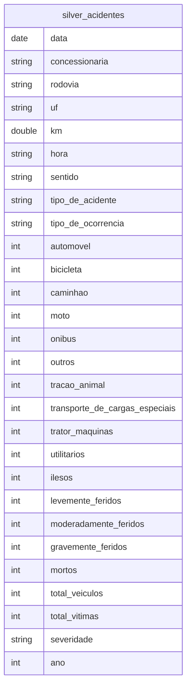

> Particionada por `(ano, concessionaria)` para pruning eficiente nas queries do Spark.

---

### Gold Layer — Constellation Schema

> **Constellation Schema:** múltiplas tabelas fato compartilhando as mesmas dimensões — padrão recomendado pela Microsoft para o Power BI quando há fatos de granularidades distintas. `id_acidente` é uma **dimensão degenerada** (sem tabela dim correspondente), mantida nos 3 fatos para rastreabilidade e drill-through.

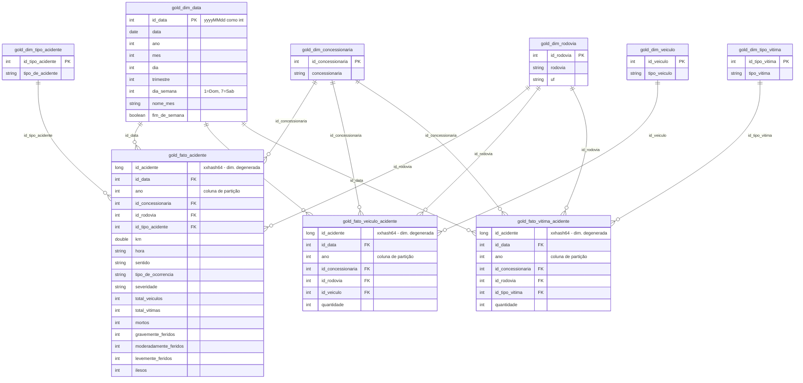

---

## 5. Pré-requisitos

- Conta Microsoft com acesso ao **Microsoft Fabric** (trial gratuito de 60 dias — não requer cartão de crédito — ou capacidade F64+)
- Navegador atualizado (Edge ou Chrome recomendado)
- **Power BI Desktop** instalado ([download gratuito](https://powerbi.microsoft.com/pt-br/downloads/))
- Arquivos CSV da ANTT — disponíveis em [dados.antt.gov.br](https://dados.antt.gov.br) ou na pasta `lakehouse_antt/Files/bronze/acidentes/` deste repositório

---

## 6. Passo a Passo de Implantação

### 6.1 Criar o Workspace

1. Acesse [app.fabric.microsoft.com](https://app.fabric.microsoft.com) e faça login com sua conta Microsoft
2. No painel lateral esquerdo, clique em **Workspaces** → **+ Novo workspace**
3. Insira o nome **`workspace-antt`**
4. Se solicitado, o Fabric pedirá para criar uma capacidade de avaliação gratuita — clique em **Criar**

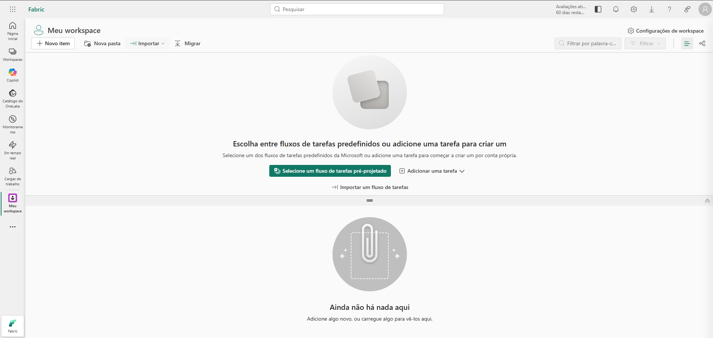

*Tela inicial do Fabric com o workspace `workspace-antt` criado e ainda vazio.*

> O trial do Fabric aparece no canto superior direito como "Avaliações ati... 60 dias resta...". Durante esse período todos os recursos estão disponíveis sem custo.

---

### 6.2 Organizar o Workspace em Pastas

Antes de criar qualquer item, organize o workspace em pastas para facilitar a navegação. Clique em **Nova pasta** e crie as 4 pastas abaixo:

| Pasta | Conteúdo |
|---|---|
| `LakeHouse` | Lakehouse `lakehouse_antt` e seus endpoints |
| `Notebooks` | Os 8 notebooks do pipeline |
| `Pipeline` | O Data Pipeline `pl_acidentes_antt` |
| `ModeloSemantico` | O Modelo Semântico e o relatório Power BI |

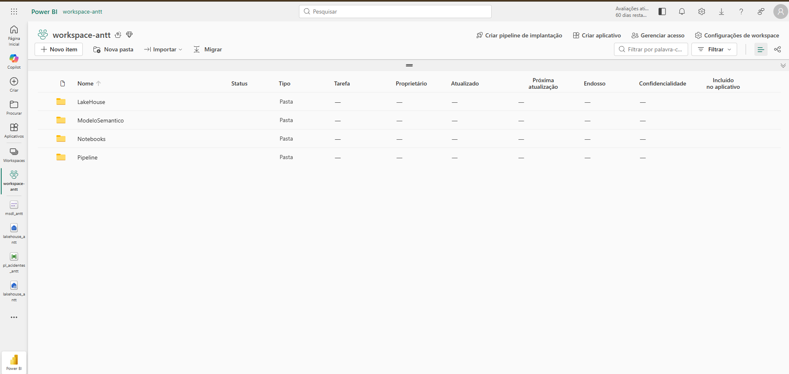

*Estrutura final do workspace com 4 pastas: **LakeHouse**, **ModeloSemantico**, **Notebooks** e **Pipeline**. Mova cada item para a pasta correspondente após criá-lo.*

> Ao criar novos itens (Lakehouse, Notebooks, Pipeline, Modelo Semântico), use o botão **"..."** (reticências) ao lado do item e selecione **Mover** para alocá-lo na pasta correta.

---

### 6.3 Criar o Lakehouse

1. Dentro do `workspace-antt`, clique em **+ Novo item**
2. No modal, selecione **Lakehouse**

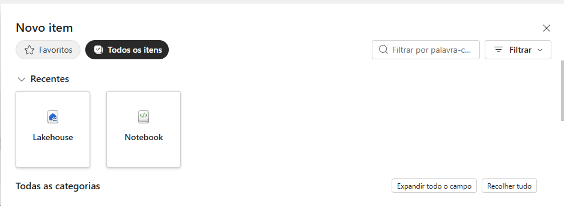

3. Nomeie como **`lakehouse_antt`** e confirme
4. Mova o item recém-criado para a pasta **LakeHouse**

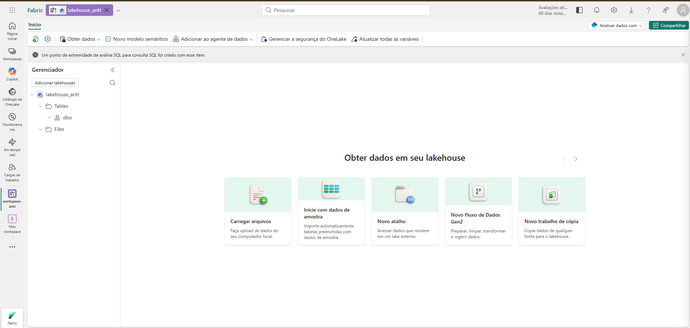

*O Lakehouse criado exibe a estrutura `Tables/` (para Delta Tables) e `Files/` (para arquivos brutos). O SQL Endpoint é criado automaticamente junto com o Lakehouse.*

---

### 6.4 Upload dos CSVs — Camada Bronze

1. No Gerenciador do Lakehouse, clique com o botão direito em **Files** → **Nova subpasta** → nomeie como `bronze`
2. Dentro de `bronze`, crie outra subpasta chamada `acidentes`
3. Selecione a pasta `acidentes` e clique em **Obter dados** → **Carregar arquivos**
4. Selecione todos os **35 arquivos** `demostrativo_acidentes_*.csv` da pasta `lakehouse_antt/Files/bronze/acidentes/` deste repositório

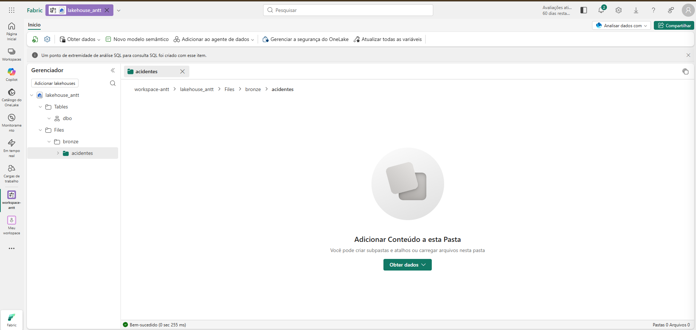

*Pasta `Files/bronze/acidentes` criada e aguardando upload. O caminho no OneLake será `workspace-antt/lakehouse_antt/Files/bronze/acidentes/`.*

Após o upload, o Gerenciador exibirá os 35 arquivos CSV:

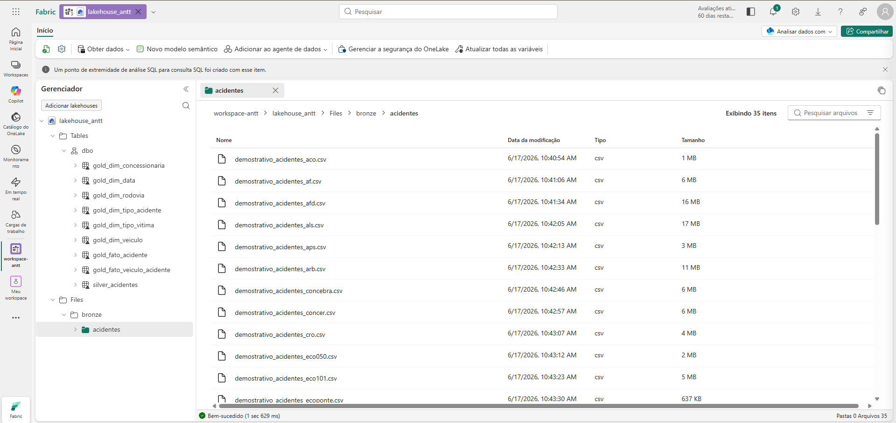

*35 arquivos CSV carregados (1 MB a 17 MB cada) e as tabelas Delta Gold já visíveis após a execução do pipeline. O Gerenciador exibe tanto `Files/bronze/acidentes/` quanto as tabelas em `Tables/dbo/`.*

---

### 6.5 Importar os Notebooks

1. No `workspace-antt`, clique em **Importar** → **Notebook** → **Do computador**
2. Selecione e importe os 8 arquivos `.ipynb` da pasta `notebooks/` deste repositório

Após o import, mova todos os notebooks para a pasta **Notebooks** do workspace.

3. Para **cada notebook**: abra-o, clique no ícone de **Lakehouse** no painel lateral e selecione **`lakehouse_antt`** como Lakehouse padrão

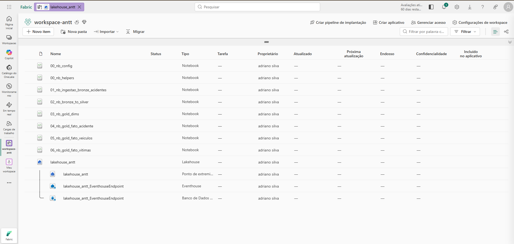

*Workspace com os 8 notebooks importados: 2 notebooks compartilhados (`00_nb_config`, `00_nb_helpers`) e 6 notebooks de pipeline (`01` ao `06`).*

#### Padrão `%run` — Notebooks Compartilhados

Os notebooks `00_nb_config` e `00_nb_helpers` funcionam como **bibliotecas reutilizáveis**. Eles não são executados diretamente pelo Pipeline — são chamados internamente pelos outros notebooks via `%run`:

```python
# Padrão obrigatório em cada notebook (01 ao 06):
NOTEBOOK_NAME: str = "nome_deste_notebook"  # deve ser definido ANTES do %run
LOG_LEVEL:     str = "INFO"

%run 00_nb_config    # configura logging centralizado → disponibiliza variável 'log'
%run 00_nb_helpers   # carrega imports, constantes (CONCESSAO_MAP, COLS_VEICULOS,
                     # COLS_VITIMAS) e funções (ler_bronze, transformar, validar...)
```

---

### 6.6 Criar o Data Pipeline

1. No `workspace-antt`, clique em **+ Novo item** → **Pipeline de dados**
2. Nomeie como **`pl_acidentes_antt`** e mova para a pasta **Pipeline**

#### Montar as atividades no canvas

Para cada atividade: clique em **+ Adicionar atividade** → **Caderno** → configure o nome e o notebook correspondente:

| Nome da atividade | Notebook vinculado | Dependência |
|---|---|---|
| Bronze - Ingestao | `01_nb_ingestao_bronze_acidentes` | — (ponto de entrada) |
| Silver - Transformacao | `02_nb_bronze_to_silver` | Após Bronze — **Em caso de êxito** |
| Gold - Dimensoes | `03_nb_gold_dims` | Após Silver — **Em caso de êxito** |
| Gold - Fato Acidente | `04_nb_gold_fato_acidente` | Após Gold Dims — **Em caso de êxito** |
| Gold - Fato Veiculos | `05_nb_gold_fato_veiculos` | Após Gold Dims — **Em caso de êxito** |
| Gold - Fato Vitimas | `06_nb_gold_fato_vitimas` | Após Gold Dims — **Em caso de êxito** |

> Para criar a **execução paralela**: arraste a seta de saída de **Gold - Dimensoes** para cada um dos 3 notebooks de fato separadamente. Os 3 irão iniciar ao mesmo tempo quando as dimensões concluírem.

O canvas ficará assim:

```
[Bronze - Ingestao] ──► [Silver - Transformacao] ──► [Gold - Dimensoes] ──┬──► [Gold - Fato Acidente]
                                                                           ├──► [Gold - Fato Veiculos]
                                                                           └──► [Gold - Fato Vitimas]
```

---

### 6.7 Executar o Pipeline

1. Clique em **Executar** no topo do canvas
2. Aguarde ~7 minutos até todas as atividades concluírem
3. Clique em qualquer atividade para inspecionar logs de entrada/saída no painel lateral direito

**Vista Lista — detalhes de cada atividade:**

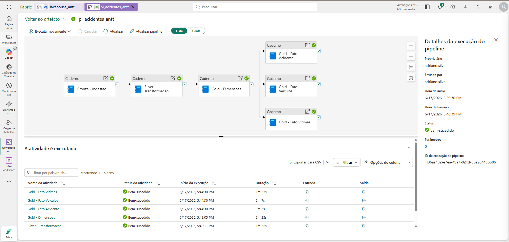

*Todas as 6 atividades com status **Bem-sucedido**. Duração individual: Bronze ~30s · Silver ~1m52s · Gold Dims ~2m23s · 3 Fatos ~2min cada (paralelo). Pipeline completo em 7 minutos.*

**Vista Gantt — paralelismo em evidência:**


*Vista Gantt mostrando a execução sequencial das etapas iniciais e o paralelismo dos 3 notebooks de fato Gold. Bronze conclui rapidamente; Silver é a etapa mais longa individualmente; os fatos executam juntos após as dimensões.*

---

### 6.8 Verificar as Tabelas no Lakehouse

Após o pipeline concluir, abra o `lakehouse_antt`. No Gerenciador em **Tables → dbo** você verá as 9 tabelas Delta criadas:

```
Tables/
└── dbo/
    ├── silver_acidentes
    ├── gold_dim_concessionaria
    ├── gold_dim_data
    ├── gold_dim_rodovia
    ├── gold_dim_tipo_acidente
    ├── gold_dim_tipo_vitima
    ├── gold_dim_veiculo
    ├── gold_fato_acidente
    ├── gold_fato_veiculo_acidente
    └── gold_fato_vitima_acidente
```

Clique em qualquer tabela com o botão direito → **Selecionar dados** para inspecionar o conteúdo:

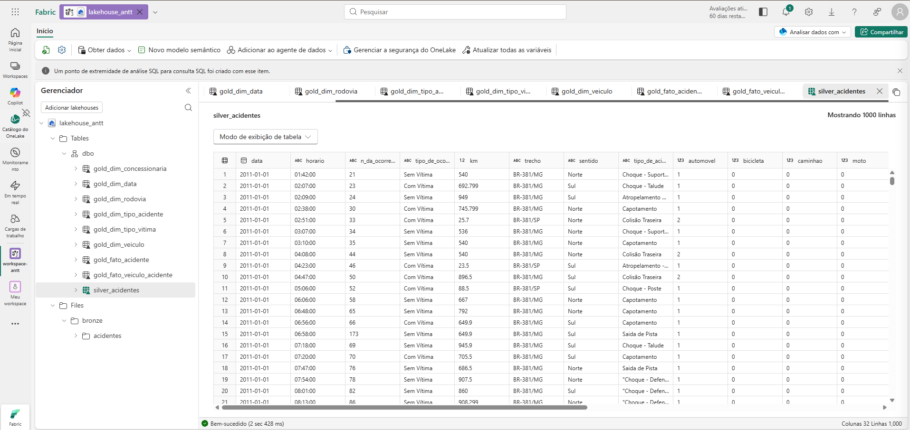

*Preview da `silver_acidentes` com 1.000 linhas — colunas normalizadas, datas parseadas e campos derivados (`total_veiculos`, `total_vitimas`, `severidade`). A barra de abas no topo exibe as outras tabelas abertas simultaneamente.*

---

### 6.9 Explorar pelo SQL Endpoint

O Fabric cria automaticamente um **SQL Endpoint** e um **Eventhouse** associados ao Lakehouse, permitindo consultas SQL diretas sem iniciar sessão Spark:

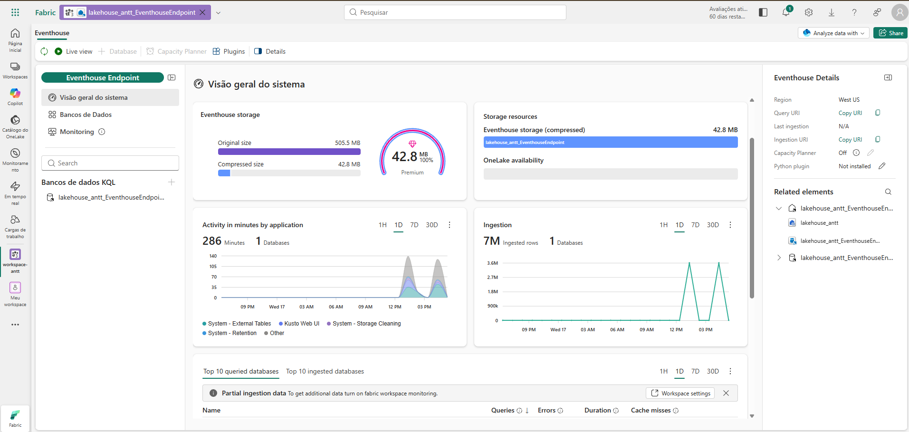

*Visão geral do Eventhouse Endpoint: **42,6 MB** de armazenamento compactado · 7 milhões de ingestões registradas · Activity timeline exibindo os picos de processamento durante a execução do pipeline.*

No banco de dados do Eventhouse, todas as tabelas Delta Gold ficam disponíveis como tabelas SQL:

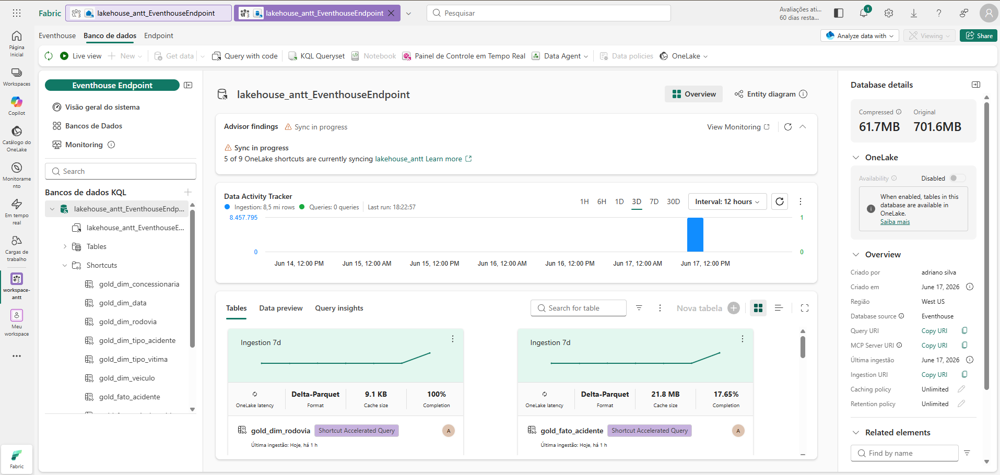

*SQL Endpoint com as 9 tabelas Gold listadas. **61,7 MB** total no OneLake · **701,6 MB** de dados originais processados. O painel "Data Tracker" confirma o status das tabelas e o uso de Delta Parquet.*

Você pode usar o SQL Endpoint para:
- Executar queries ad-hoc diretamente no browser
- Conectar ferramentas externas via string de conexão JDBC/TDS
- Validar o resultado das transformações com SQL padrão

---

### 6.10 Criar o Modelo Semântico

O Modelo Semântico conecta as tabelas Gold ao Power BI via **Direct Lake** — leitura direta dos arquivos Parquet do OneLake, sem importação de dados e sem cache separado.

#### Criar a partir do Lakehouse

1. No `lakehouse_antt`, clique em **Novo modelo semântico** (barra superior)
2. Nomeie como **`msdl_antt`** e selecione as 9 tabelas Gold (6 dims + 3 fatos)
3. Clique em **Confirmar** — o modelo abre no editor de relacionamentos
4. Mova o `msdl_antt` para a pasta **ModeloSemantico** no workspace

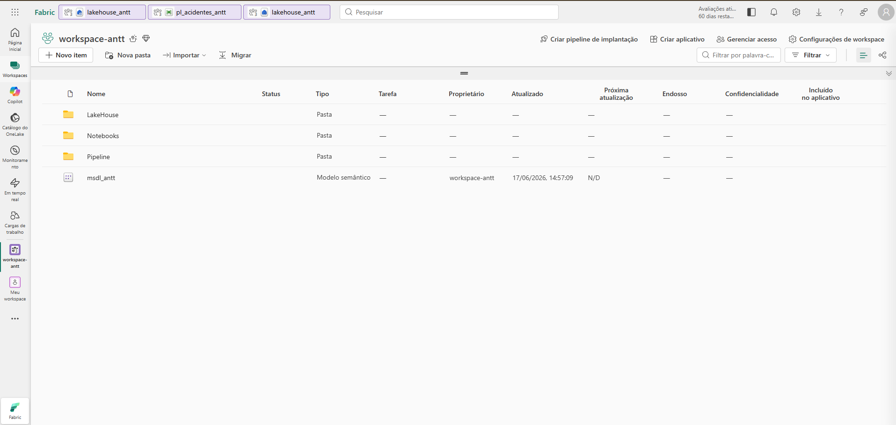

*Workspace organizado após a criação do Modelo Semântico `msdl_antt`. A pasta `ModeloSemantico` agrupa o modelo semântico separado dos notebooks e do pipeline.*

#### Configurar os relacionamentos

Na **Exibição de modelo**, arraste as colunas para criar os 12 relacionamentos do Constellation Schema:

| Tabela Fato | Coluna FK | Tabela Dim | Coluna PK |
|---|---|---|---|
| `gold_fato_acidente` | `id_data` | `gold_dim_data` | `id_data` |
| `gold_fato_acidente` | `id_concessionaria` | `gold_dim_concessionaria` | `id_concessionaria` |
| `gold_fato_acidente` | `id_rodovia` | `gold_dim_rodovia` | `id_rodovia` |
| `gold_fato_acidente` | `id_tipo_acidente` | `gold_dim_tipo_acidente` | `id_tipo_acidente` |
| `gold_fato_veiculo_acidente` | `id_data` | `gold_dim_data` | `id_data` |
| `gold_fato_veiculo_acidente` | `id_concessionaria` | `gold_dim_concessionaria` | `id_concessionaria` |
| `gold_fato_veiculo_acidente` | `id_rodovia` | `gold_dim_rodovia` | `id_rodovia` |
| `gold_fato_veiculo_acidente` | `id_veiculo` | `gold_dim_veiculo` | `id_veiculo` |
| `gold_fato_vitima_acidente` | `id_data` | `gold_dim_data` | `id_data` |
| `gold_fato_vitima_acidente` | `id_concessionaria` | `gold_dim_concessionaria` | `id_concessionaria` |
| `gold_fato_vitima_acidente` | `id_rodovia` | `gold_dim_rodovia` | `id_rodovia` |
| `gold_fato_vitima_acidente` | `id_tipo_vitima` | `gold_dim_tipo_vitima` | `id_tipo_vitima` |

> **Importante:** NÃO conecte tabelas fato entre si (`fato_acidente` ↔ `fato_veiculo` ↔ `fato_vitima`). O Power BI não suporta relacionamentos fato-para-fato. O campo `id_acidente` é degenerado e serve apenas para drill-through.

**Antes de configurar os relacionamentos:**

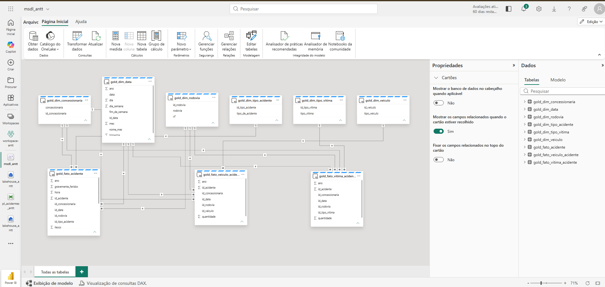

*Tabelas importadas no editor do Modelo Semântico, ainda sem relacionamentos. O painel direito "Dados" lista as 9 tabelas Gold disponíveis.*

**Após configurar todos os relacionamentos:**

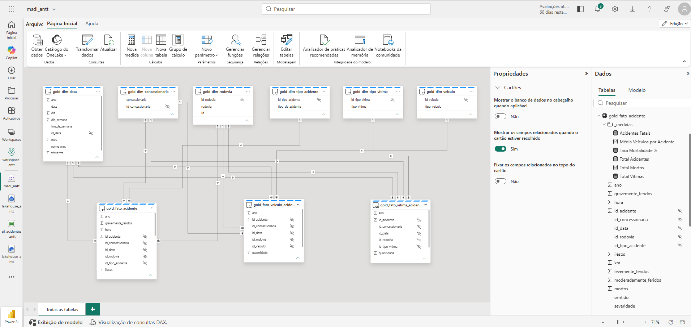

*Constellation Schema configurado: as 3 tabelas fato (centro) conectadas às dimensões compartilhadas. Note que não há linhas entre as tabelas fato — apenas entre fato e dimensão.*

---

### 6.11 Criar o Relatório no Power BI

Com o Modelo Semântico configurado, crie as medidas DAX (seção [9. Medidas DAX](#9-medidas-dax)) e construa os visuais:

**Em construção no Power BI Desktop:**

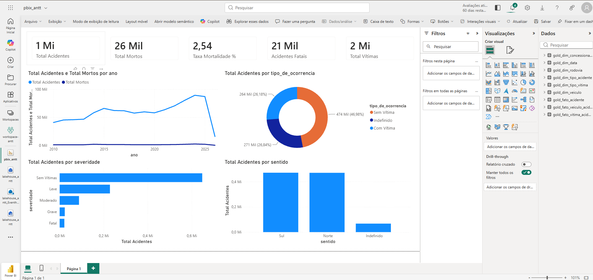

*Fase de construção: visuais sendo posicionados com os campos do Modelo Semântico conectado via Direct Lake. O painel "Dados" à direita mostra as tabelas e medidas disponíveis.*

**Resultado final publicado no Fabric:**


*Dashboard publicado no Fabric com os 5 KPI Cards no topo e 4 gráficos: tendência histórica de acidentes e mortos (linha), distribuição por tipo de ocorrência (rosca), perfil por severidade (barras horizontais) e por sentido (barras verticais).*

---

## 7. Notebooks — Detalhes Técnicos

### `00_nb_config` — Logging Centralizado

Configura o logger Python com nível e formato padronizados para todos os notebooks. Deve ser chamado via `%run` com `NOTEBOOK_NAME` e `LOG_LEVEL` já definidos no escopo do chamador.

```python
import logging
logging.basicConfig(
    level=getattr(logging, LOG_LEVEL),
    format="%(asctime)s | %(levelname)-8s | %(message)s",
    datefmt="%H:%M:%S",
    force=True,
)
log = logging.getLogger(NOTEBOOK_NAME)
log.info("Logging configurado | notebook=%s | level=%s", NOTEBOOK_NAME, LOG_LEVEL)
```

---

### `00_nb_helpers` — Funções Compartilhadas

| Função | Responsabilidade |
|---|---|
| `ler_bronze(path)` | Lê CSVs com encoding Windows-1252 e separador `;` |
| `mapear_concessionaria(df, mapa)` | Deriva o nome da concessionária a partir do nome do arquivo-fonte |
| `transformar(df)` | Parse de data (`dd/MM/yyyy`), km (`double`), hora; normaliza sentido e tipo de ocorrência; calcula `total_veiculos`, `total_vitimas` e `severidade` |
| `validar(df)` | Verifica nulos em colunas críticas e loga alertas de qualidade |
| `salvar_silver(df, tabela, modo, partições)` | Persiste Delta Table com `OPTIMIZE` e relatório de estatísticas |

---

### `01` — Bronze: Ingestão e Validação

Lê todos os CSVs de `Files/bronze/acidentes/`, aplica `ler_bronze()` e registra o total de arquivos e linhas por concessionária. Mantém os dados no formato original para rastreabilidade total.

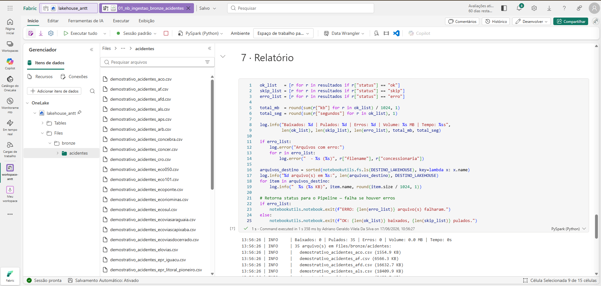

*Notebook `01_nb_ingestao_bronze_acidentes` em execução. A célula de Relatório lista todos os 35 arquivos CSV carregados com seus respectivos tamanhos e totais de linhas. O Gerenciador à esquerda mostra os CSVs em `Files/bronze/acidentes/`.*

---

### `02` — Silver: Transformação e Qualidade

Aplica o pipeline completo de limpeza e enriquecimento:

- Parse de `data` (`dd/MM/yyyy` → `DateType`)
- Conversão de `km` (string com vírgula → `DoubleType`)
- Normalização de `sentido` e `tipo_de_ocorrencia` (uppercase, strip)
- Derivação de `concessionaria` a partir do nome do arquivo-fonte via `CONCESSAO_MAP`
- Cálculo de `total_veiculos` (soma das 10 colunas de veículo)
- Cálculo de `total_vitimas` (soma das 5 colunas de vítima)
- Classificação de `severidade` com base nas colunas de vítima
- Persistência particionada por `(ano, concessionaria)` com `OPTIMIZE`

---

### `03` — Gold: Dimensões

Cria as 6 dimensões em uma única execução idempotente (`overwrite`):

| Dimensão | Linhas esperadas | Surrogate Key |
|---|---|---|
| `gold_dim_data` | 1 por data de acidente | **Smart SK:** `yyyyMMdd` como `int` — join eficiente sem tabela de lookup extra |
| `gold_dim_concessionaria` | ~35 | `row_number()` ordenado por nome |
| `gold_dim_rodovia` | 1 por combinação rodovia+UF | `row_number()` ordenado por UF, rodovia |
| `gold_dim_tipo_acidente` | 1 por tipo | `row_number()` |
| `gold_dim_veiculo` | 10 (estática) | Sequencial 1-10 — criada via `spark.createDataFrame()` |
| `gold_dim_tipo_vitima` | 5 (estática) | Sequencial 1-5 — criada via `spark.createDataFrame()` |

---

### `04` — Gold: Fato Acidente

Tabela fato principal com granularidade de **1 linha por acidente**. Geração do surrogate key determinístico:

```python
F.xxhash64(F.col("data"), F.col("concessionaria"),
           F.col("km"), F.col("hora"), F.col("tipo_de_acidente"))
```

O mesmo algoritmo é aplicado nos notebooks 04, 05 e 06 — garantindo que o mesmo acidente receba o mesmo `id_acidente` nos 3 fatos sem necessidade de lookup.

---

### `05` — Gold: Fato Veículos

Unpivot de **10 colunas de veículo** (formato wide) para formato long `(tipo_veiculo, quantidade)`. Apenas registros com `quantidade > 0` são gravados, reduzindo o volume da tabela:

```python
# SQL stack() para unpivot eficiente via Catalyst optimizer
stack(10, 'automovel', automovel, 'bicicleta', bicicleta, 'caminhao', caminhao,
          'moto', moto, 'onibus', onibus, 'outros', outros,
          'tracao_animal', tracao_animal, 'transporte_de_cargas_especiais', transporte_de_cargas_especiais,
          'trator_maquinas', trator_maquinas, 'utilitarios', utilitarios)
    as (tipo_veiculo, quantidade)
```

---

### `06` — Gold: Fato Vítimas

Unpivot de **5 colunas de vítima** para `(tipo_vitima, quantidade)` — mesma lógica do notebook 05.

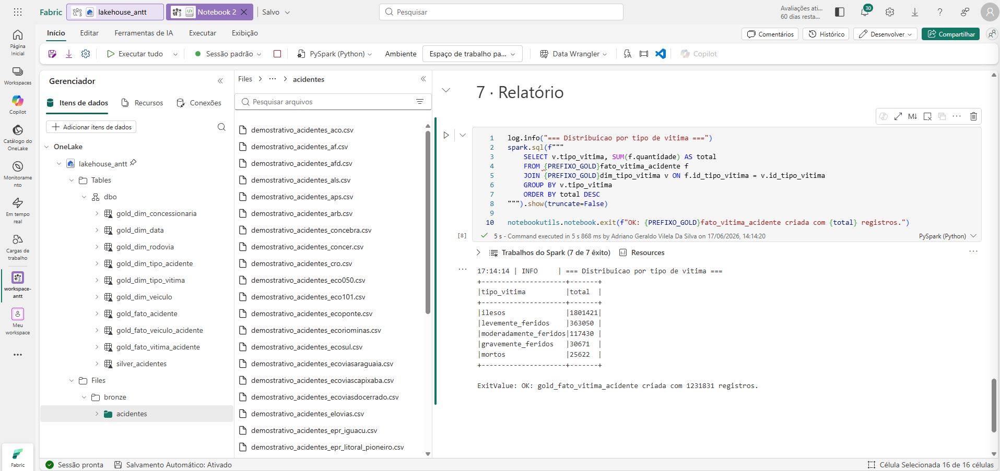

*Notebook `06_nb_gold_fato_vitimas` em execução. A célula de Relatório exibe a distribuição final por tipo de vítima após o unpivot. O Gerenciador à esquerda confirma todas as tabelas Gold criadas no Lakehouse.*

---

## 8. Otimizações Spark

Aplicadas nos 4 notebooks Gold (03, 04, 05, 06):

```python
# AQE — Adaptive Query Execution: replanning dinâmico de joins e partições em runtime
spark.conf.set("spark.sql.adaptive.enabled", "true")

# CoalescePartitions: consolida partições pequenas após shuffles automaticamente
# Equivalente ao shuffle.partitions="auto" do Spark 3.4+ (não disponível no Fabric Runtime 1.2)
spark.conf.set("spark.sql.adaptive.coalescePartitions.enabled", "true")

# Broadcast automático para tabelas até 100 MB (elimina o sort-merge join custoso)
spark.conf.set("spark.sql.autoBroadcastJoinThreshold", str(100 * 1024 * 1024))
```

**Broadcast explícito** nas dimensões (garantia adicional além do threshold automático):

```python
df.join(F.broadcast(dim_data.select("data", "id_data")), on="data", how="left")
  .join(F.broadcast(dim_concessionaria.select("concessionaria", "id_concessionaria")), ...)
  .join(F.broadcast(dim_rodovia.select("rodovia", "uf", "id_rodovia")), ...)
```

**Particionamento e compactação física** nas tabelas Gold:

```python
# Partition pruning: Spark/Power BI lê apenas a partição do ano filtrado
fato.write.partitionBy("ano")

# OPTIMIZE compacta arquivos pequenos do Spark em Parquet maiores
# ZORDER ordena fisicamente os dados pelas colunas mais usadas em filtros
spark.sql("OPTIMIZE gold_fato_acidente ZORDER BY (id_data, id_concessionaria, id_rodovia)")
spark.sql("OPTIMIZE gold_fato_veiculo_acidente ZORDER BY (id_data, id_concessionaria, id_veiculo)")
spark.sql("OPTIMIZE gold_fato_vitima_acidente ZORDER BY (id_data, id_concessionaria, id_tipo_vitima)")
```

> **Fabric Runtime 1.2 (Spark 3.3):** `spark.sql.shuffle.partitions = "auto"` não é suportado — apenas no Spark 3.4+. O AQE com `coalescePartitions.enabled=true` fornece comportamento equivalente e já está habilitado acima.

---

## 9. Medidas DAX

Crie as medidas abaixo na tabela `gold_fato_acidente` do Modelo Semântico.  
No Power BI Desktop: selecione a tabela → **Nova medida** → cole a fórmula DAX.

```dax
Total Acidentes =
COUNTROWS( gold_fato_acidente )

Total Mortos =
SUM( gold_fato_acidente[mortos] )

Total Vítimas =
SUM( gold_fato_acidente[total_vitimas] )

Acidentes Fatais =
CALCULATE(
    COUNTROWS( gold_fato_acidente ),
    gold_fato_acidente[severidade] = "Fatal"
)

Taxa Mortalidade % =
DIVIDE( [Total Mortos], [Total Acidentes], 0 )

Média Veículos por Acidente =
DIVIDE(
    SUM( gold_fato_acidente[total_veiculos] ),
    [Total Acidentes],
    0
)

Total Veículos Envolvidos =
SUM( gold_fato_veiculo_acidente[quantidade] )

Total Vítimas Detalhado =
SUM( gold_fato_vitima_acidente[quantidade] )
```

---

## 10. Sugestão de Dashboard

### Página 1 — Visão Geral

| Visual | Tipo | Campos |
|---|---|---|
| Total Acidentes | Cartão KPI | `[Total Acidentes]` |
| Total Mortos | Cartão KPI | `[Total Mortos]` |
| Taxa Mortalidade | Cartão KPI | `[Taxa Mortalidade %]` |
| Acidentes Fatais | Cartão KPI | `[Acidentes Fatais]` |
| Total Vítimas | Cartão KPI | `[Total Vítimas]` |
| Tendência histórica | Gráfico de linhas | Eixo X: `dim_data[ano]` · Y: `[Total Acidentes]` + `[Total Mortos]` |
| Por tipo de ocorrência | Gráfico de rosca | Legenda: `fato_acidente[tipo_de_ocorrencia]` · Valores: `[Total Acidentes]` |
| Por severidade | Barras horizontais | Eixo Y: `fato_acidente[severidade]` · X: `[Total Acidentes]` |
| Por sentido | Barras verticais | Eixo X: `fato_acidente[sentido]` · Y: `[Total Acidentes]` |

### Página 2 — Temporal

| Visual | Tipo | Campos |
|---|---|---|
| Acidentes por mês | Gráfico de linhas | Eixo X: `dim_data[mes]` · Y: `[Total Acidentes]` |
| Por dia da semana | Colunas | Eixo X: `dim_data[dia_semana]` · Y: `[Total Acidentes]` |
| Fim de semana vs Dia útil | Rosca | Legenda: `dim_data[fim_de_semana]` · Valores: `[Total Acidentes]` |
| Por hora do dia | Colunas | Eixo X: `fato_acidente[hora]` · Y: `[Total Acidentes]` |

### Página 3 — Geografia

| Visual | Tipo | Campos |
|---|---|---|
| Por UF | Mapa coroplético | Localização: `dim_rodovia[uf]` · Valores: `[Total Acidentes]` |
| Top 15 rodovias | Barras horizontais | Eixo Y: `dim_rodovia[rodovia]` · X: `[Total Acidentes]` |
| Por concessionária | Barras agrupadas | Eixo Y: `dim_concessionaria[concessionaria]` · X: `[Total Acidentes]` + `[Total Mortos]` |

### Página 4 — Veículos e Vítimas

| Visual | Tipo | Campos |
|---|---|---|
| Veículos mais envolvidos | Barras horizontais | Eixo Y: `dim_veiculo[tipo_veiculo]` · X: `[Total Veículos Envolvidos]` |
| Distribuição de vítimas | Colunas empilhadas | Eixo X: `dim_tipo_vitima[tipo_vitima]` · Y: `[Total Vítimas Detalhado]` |
| Severidade por tipo de acidente | Barras 100% empilhadas | Eixo Y: `dim_tipo_acidente[tipo_de_acidente]` · X: `[Total Acidentes]` por severidade |

### Slicers recomendados (em todas as páginas)

```
Ano          → dim_data[ano]
Concessionária → dim_concessionaria[concessionaria]
UF           → dim_rodovia[uf]
Severidade   → fato_acidente[severidade]
```

---

## Licença

Dados públicos da ANTT disponibilizados sob a [Lei de Acesso à Informação (LAI)](https://www.gov.br/antt/pt-br/acesso-a-informacao/dadosabertos).  
Código deste repositório disponível sob licença **MIT**.
