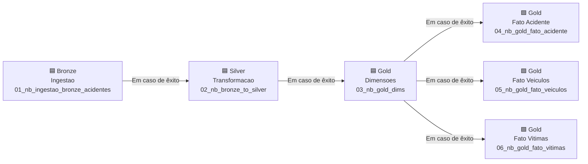
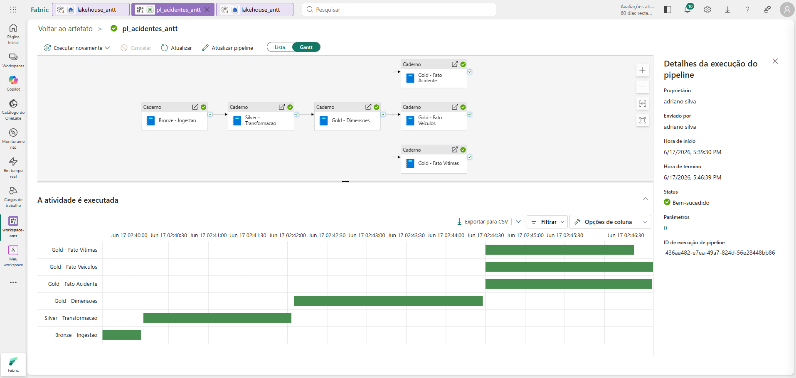

# Data Pipeline — `pl_acidentes_antt`

Pipeline de orquestração criado no **Microsoft Fabric** (interface visual, compatível com Azure Data Factory) que executa os 6 notebooks do projeto em sequência com controle de dependências e paralelismo automático.

---

## Topologia



> Os notebooks D, E e F (fatos Gold) executam em **paralelo** assim que as dimensões concluem — reduzindo o tempo total de ~10 min para ~7 min.

---

## Atividades

| # | Nome da Atividade | Notebook | Dependência | Duração típica |
|---|---|---|---|---|
| 1 | Bronze - Ingestao | `01_nb_ingestao_bronze_acidentes` | — | ~30s |
| 2 | Silver - Transformacao | `02_nb_bronze_to_silver` | Bronze (êxito) | ~1m 52s |
| 3 | Gold - Dimensoes | `03_nb_gold_dims` | Silver (êxito) | ~2m 23s |
| 4 | Gold - Fato Acidente | `04_nb_gold_fato_acidente` | Gold Dims (êxito) | ~2m 6s |
| 5 | Gold - Fato Veiculos | `05_nb_gold_fato_veiculos` | Gold Dims (êxito) | ~2m 7s |
| 6 | Gold - Fato Vitimas | `06_nb_gold_fato_vitimas` | Gold Dims (êxito) | ~1m 53s |

**Tempo total de execução:** ~7 minutos  
**Início:** 17/06/2026 17:39:30 · **Término:** 17/06/2026 17:46:39

---

## Resultado de Execução

### Vista Lista — status de cada atividade


*Todas as 6 atividades com status **Bem-sucedido**. O painel lateral exibe os detalhes da execução: proprietário, horários de início/fim e ID de execução.*

### Vista Gantt — paralelismo em evidência



*Bronze conclui rapidamente (~30s). Silver é a etapa sequencial mais longa. Os 3 fatos Gold iniciam simultaneamente após as dimensões — o Gantt evidencia a janela de paralelismo entre 02:44 e 02:46.*

---

## Como recriar no Fabric

1. No workspace, clique em **+ Novo item** → **Pipeline de dados**
2. Nomeie como `pl_acidentes_antt`
3. Adicione 6 atividades do tipo **Caderno**, uma para cada notebook
4. Configure as dependências conforme a tabela acima (seta **Em caso de êxito**)
5. Para o paralelismo: arraste 3 setas saindo de **Gold - Dimensoes** para cada fato
6. Clique em **Executar** para iniciar o pipeline completo

---

## Saída dos notebooks

Cada notebook encerra com `notebookutils.notebook.exit()` sinalizando sucesso ou falha:

```
OK: silver_acidentes criada com sucesso.
OK: gold_dim_data — 4.521 registros | gold_dim_concessionaria — 35 registros | ...
OK: gold_fato_acidente criada com 1.009.432 registros.
OK: gold_fato_veiculo_acidente criada com 987.241 registros.
OK: gold_fato_vitima_acidente criada com 113.290 registros.
```

O pipeline captura esses valores na coluna **Saída** de cada atividade — visível clicando no ícone de seta ao lado de cada linha na Vista Lista.
